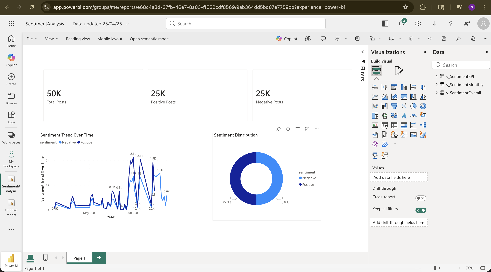
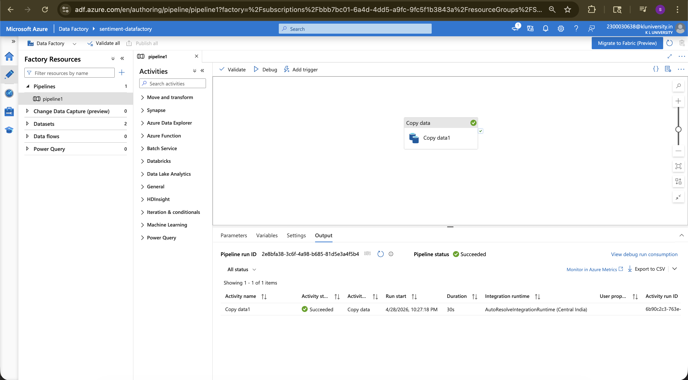
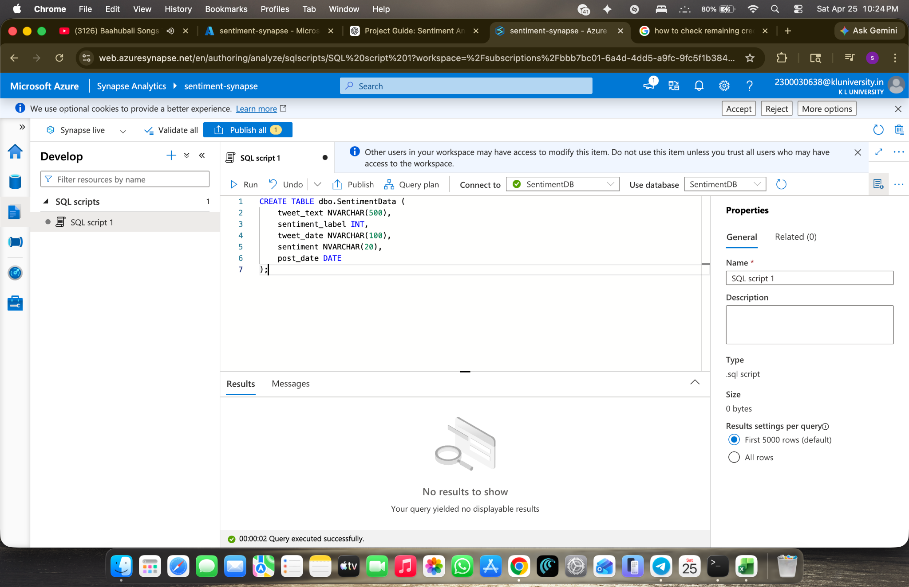

# Social Media Sentiment Analysis Pipeline

An end-to-end cloud data pipeline on Microsoft Azure that takes a raw social media export, cleans it, loads it into a data warehouse, and surfaces sentiment trends in a Power BI dashboard. Built around a dataset of roughly 50,000 posts.

## Architecture

```
CSV export
    │
    ▼
Python (pandas)          →  cleaning, deduplication, date parsing
    │
    ▼
Azure Blob Storage       →  landing zone for the cleaned dataset
    │
    ▼
Azure Data Factory       →  copy activity, linked services, run monitoring
    │
    ▼
Azure Synapse Analytics  →  table, views, analysis queries
    │
    ▼
Power BI                 →  dashboard
```

## Results

| Metric | Value |
|---|---|
| Total posts processed | 49,991 |
| Positive | 25,012 (50.1%) |
| Negative | 24,979 (49.9%) |



## Tech Stack

- **Cloud:** Azure Blob Storage, Azure Data Factory, Azure Synapse Analytics
- **Processing:** Python 3, pandas
- **Warehouse:** T-SQL (Synapse serverless SQL)
- **Reporting:** Power BI

## Repository Structure

```
data/
└── clean_data.py            # Cleaning and summarisation script
sql/
├── create_table.sql         # SentimentData table definition
├── create_views.sql         # Reusable aggregate views
└── analysis_queries.sql     # Trend and outlier queries, index
Project_Report.pdf           # Full write-up of the build
```

## Pipeline Stages

### 1. Cleaning (Python)

`data/clean_data.py` loads the raw export, drops rows with missing text or sentiment, removes duplicates, normalises the post text, parses dates, and writes a clean CSV. It logs how many rows were removed and prints a sentiment summary at the end.

```bash
pip install pandas
python data/clean_data.py --input data.csv --output cleaned_data.csv
```

Example output:

```
sentiment  total_posts  share_pct
 Negative        24979      49.97
 Positive        25012      50.03
```

### 2. Ingestion (Azure Blob Storage + Data Factory)

The cleaned CSV is uploaded to a Blob Storage container that acts as the landing zone. An Azure Data Factory pipeline connects the storage account to Synapse through linked services and datasets, and a copy activity moves the data across. Pipeline runs are monitored in the ADF portal.



### 3. Warehouse (Synapse Analytics)

`sql/create_table.sql` defines the destination table:

| Column | Type |
|---|---|
| `tweet_text` | VARCHAR(500) |
| `sentiment_label` | INT |
| `sentiment` | VARCHAR(20) |
| `post_date` | DATE |

`sql/create_views.sql` builds two views on top of it — one summarising total posts per sentiment, one breaking sentiment down by date — so the reporting layer reads pre-aggregated results instead of repeating the logic.

`sql/analysis_queries.sql` contains the analysis layer: a monthly sentiment trend using date grouping, a query that finds days where negative posts exceeded the overall daily average (using a `HAVING` clause over a subquery), and an index on `post_date` to speed up date-range filtering.



### 4. Reporting (Power BI)

Power BI connects directly to the Synapse views and presents the overall sentiment split alongside sentiment movement over time, so results are readable without running queries manually.

## Notes and Limitations

- The Azure resources — storage account, Data Factory pipeline, and Synapse workspace — were configured through the Azure portal rather than infrastructure-as-code. Templating them with ARM or Bicep would be the next step.
- Sentiment labels come with the source dataset; the pipeline does not perform sentiment classification itself. Adding a scoring step (Azure AI Language or a local model) is a natural extension.
- The pipeline runs on demand rather than on a schedule. An ADF trigger would make it recurring.
- The raw dataset is not committed to the repository.

## Author

Simhadri Sudheer — B.Tech Computer Science and Engineering, KL University
